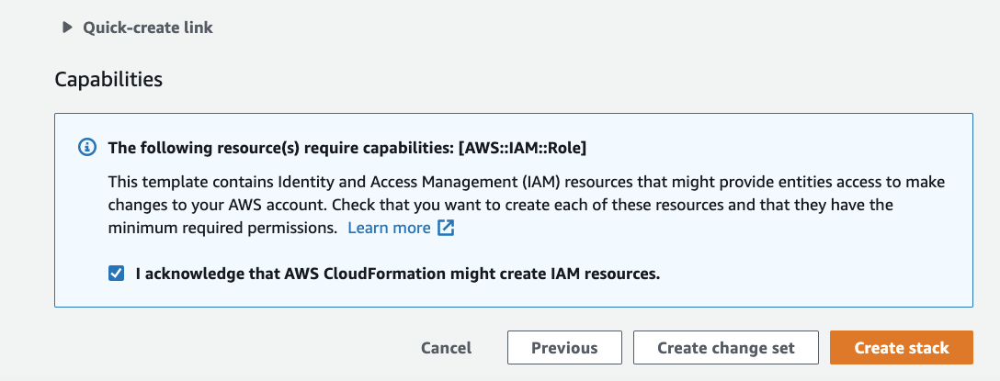
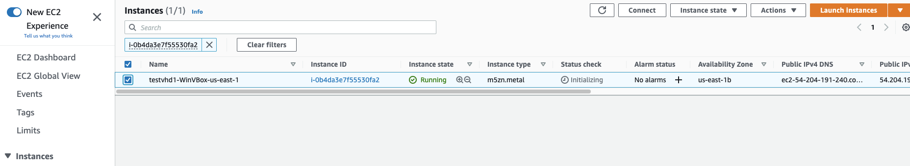

# Virtualization of a VHD image on top of EC2 Metal instance

## Table of Contents
* [Overview](#overview)
* [Example CloudFormation Deployment](#example-cloudformation-deployment)
* [Connecting to the EC2 Windows Server via RDP](#connecting-to-the-ec2-windows-server-via-rdp)
* [How to start the virtual image](#how-to-start-the-virtual-image)
* [How to copy files to/from your S3 bucket](#how-to-copy-files-to-from-your-s3-bucket)
* [How to remove/cleanup the infrastructure](#how-to-remove-cleanup-the-infrastructure)

## Overview
The purpose of this Cloudformation template is to stand up a single EC2 instance running Windows Server with VirtualBox, FireFox, and Cyberduck during creation. It will also pull down a VHD image from a S3 bucket, copy it to the local machine, and configure VirtualBox for it.

## Example CloudFormation Deployment
1. Download the file [WindowsDeployVBoxMetal.yml](./WindowsDeployVBoxMetal.yml)
1. Login to your AWS account and select CloudFormation from the service list.
  
1. Click on the "create stack" then "with new resources (standard)"
  
1. Click on "Upload a template file" and then click "Choose File"
  
1. Select the file you downloaded above (WindowsDeployVBoxMetal.yml) and then click "Next"
  
1. Stack details:
    * Stack Name
        * Stack Name - enter a stack name, such as "TestVHD1". You can name this whatever you want, and it will be used as the name given to the EC2 instance.
    * **EC2 Instance Configuration:**
        * InstanceAMI - you can select a different base AMI if you wish, but for the purposes of this POC we simply use a base Windows Server 2019 AMI.
        * InstanceType - you can select any metal based x86 instance type from the drop down list. **Please check with [AWS pricing calculator](https://calculator.aws/) before you proceed as all of these EC2 types do carry a higher price per hour.** As an example, this POC is using a m5zn.metal instance in us-east-1, which currently costs $3.9641 per hour.
        * KeyPair - Select an existing EC2 KeyPair to utilize to get the Administrator password for the EC2 instance once created. If you do not have a keypair already created, please do so outside of this CloudFormation template.  
    * **EC2 Network Configuration:**
        * VPCId - The VPC ID where you want to place this EC2 instance
        * SubnetId - The Subnet ID where you want to place this EC2 instance
        * RDPLocation - This is the IP range you wish to gain access to the RDP connection for this EC2 instance.
    * **Virtual Machine Configuration:**
        * S3 Bucket Name - This is the bucket name that holds your VHD image file
        * S3FileName - This is the location within the bucket where the VHD image file is located
        * Name and location of file on local - This is where you would like the file placed on the local disk. *If your instance type comes with ephemeral storage, you could copy the file there for the fastest access*
        * VBoxOsType - This is the type of virtual machine you are loading from the VHD file. This corresponds with the VirtualBox OS types.
    * Click Next
  
1. Under the configure stack options, you can scroll to the bottom and click Next
  
1. On the next screen, scroll to the bottom and check the box "I acknowledge that AWS CloudFormation might create IAM resources" and then click "Create stack"
  
1. You should now see the event screen showing the progress of your CloudFormation template
  
1. This process can take up to 5 minutes. Once you see "CREATE_COMPLETE" for the whole stack, you can proceed.
  
1. Click on the "Resources" tab, then click on the link next to the name "TestServerHost"
  
1. You will now see the EC2 instance page and it will have automatically narrowed the search to this EC2 instance.
  
1. Click the checkbox next to the instance name, then click "Connect" from the menu bar
  
1. You will be preseneted with this screen, click on "RDP client"
  
1. Click on "Download remote desktop file", then click on "Get password"
  
1. Click on Browse and select the key file (or copy and paste into the window)
  
1. Click "Decrypt Password"
  
1. You can now see the Administrator password listed in the window. Copy this into your clipboard.
  

## Connecting to the EC2 Windows Server via RDP
1. Open a RDP application and add the RDP file you downloaded above.
  
1. Open the connection and copy the Administrator password you copied above.
  
1. Click "Continue" for the certificate error
  
1. You should now see a Windows Desktop image
  

## How to start the virtual image
1. Double click on Oracle VM VirtualBox
  
1. Double click on LabTest
  
1. You should see the computer boot and display the desktop.
  

## How to copy files to/from your S3 bucket
1. In case you want to copy files to/from the same S3 bucket, Cyberduck has been installed on the instance.
1. Double click on US3Access icon on the desktop
  

## How to remove/cleanup the infrastructure
1. Go back to your AWS CloudFormation console and click on "Delete" from the menu bar
  
1. Click on "Delete stack"
  
1. This will start the process of removing all of the various components created and delete the EC2 instance as well.
